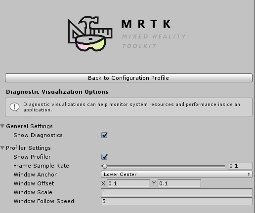

# Diagnostic System

The Mixed Reality Toolkit Diagnostics System provides diagnostic tools that run within the 
application to enable analysis of application issues. 

The first release of the diagnostics system contains the Visual Profiler to allow for analyzing 
performance issues while using the application. 

## Getting Started

> It is **_highly_** recommended that the diagnostics system be enabled throughout the entire product 
development cycle and disabled as the last change prior to building and releasing the final version.

1. [Enable](#enable-diagnostics) the diagnostic system
2. [Configure](#configure-diagnostic-options) diagnostic options
3. [Build and deploy](#build-and-deploy)

### Enable Diagnostics

The diagnostics system is managed by the MixedRealityToolkit object (or another 
[service registrar](xref:Microsoft.MixedReality.Toolkit.IMixedRealityServiceRegistrar) component). 

> The following steps presume use of the MixedRealityToolkit object. Steps required for other service registrars may be different.

1. Select the MixedRealityToolkit object in the scene hierarchy.

2. Navigate the Inspector panel to the Diagnostics System section and check Enable

3. Select the Diagnostics System implementation

> Users of the default profile (DefaultMixedRealityToolkitConfigurationProfile) will have the 
diagnostics system pre-configured to use the MixedRealityDiagnosticsSystem object.

### Configure Diagnostic Options

The diagnostics system uses a configuration profile to specify which components are to be displayed 
and to configure their settings. Please see [Configuring the Diagnostics System](ConfiguringDiagnostics.md) 
for more information pertaining to the available component settings. 

 

### Build and Deploy

Once the diagnostic system is configured with the desired options, the project can be built 
and deployed to the target platform.

> While it is possible to use Unity's Play Mode while developing applications without requiring the build 
and deploy steps, it is important to evaluate the diagnostics system results using a compiled application 
running on the target hardware and platform. Performance diagnostics, such as the Visual Profiler, may not 
accurately reflect actual application performance when run from within the editor.

## See Also

- [Diagnostics API documentation](xref:Microsoft.MixedReality.Toolkit.Diagnostics)
- [Configuring the Diagnostics System](ConfiguringDiagnostics.md)
- [Using the Visual Profiler](../TODO.md)

