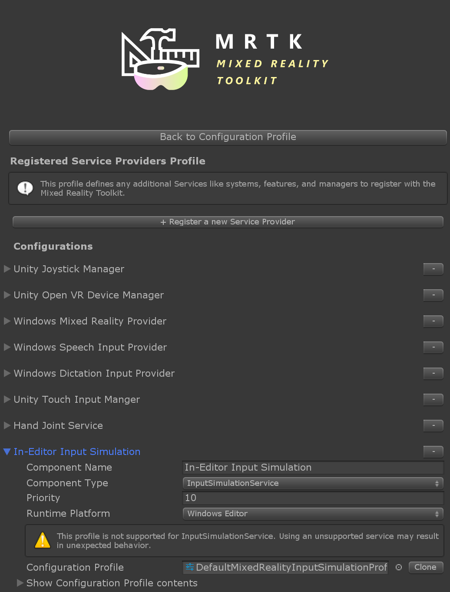

# Input Simulation Service

The Input Simulation Service emulates the behaviour of devices and platforms that may not be available in the Unity editor. Examples include:
* Hololens or VR device head tracking
* Hololens version 1 hand gestures
* Hololens version 2 articulated hand tracking

Users can use a conventional keyboard and mouse combination to control simulated devices at runtime. This allows testing of interactions in the Unity editor without first deploying to a device.

## Enabling the Input Simulation Service

Input simulation is enabled by default in MRTK.

Input simulation is an optional [Mixed Reality service](../../External/Documentation/MixedRealityServices.md). It can be added or removed in to the [Registered Service Providers profile](../TODO.md). Select _Microsoft.MixedReality.Toolkit.Input > InputSimulationService_ as the __Component Type__. The __Runtime Platform__ should always be _Windows Editor_ since the service depends on keyboard and mouse input. The Input Simulation Service has its own profile linked under __Configuration Profile__.

| __Warning__: Any type of profile can be assigned to services at the time of this writing. If you assign a different profile to the service, make sure to use a profile of type _Input Simulation_ or it will not work! |
| --- |

# Camera Control

Head movement can be emulated by the Input Simulation Service.

## Rotating the camera

1. Hover over the viewport editor window.

   _You may need to click the window to give it input focus if button presses don't work._

2. Press and hold the __Mouse Look Button__ (default: Right mouse button).
3. Move the mouse in the viewport window to rotate the camera.

## Moving the camera

Press and hold the movement keys (W/A/S/D for forward/left/back/right).

# Hand Simulation

The input simulation supports emulated hand devices. These virtual hands can interact with any object that supports regular hand devices, such as buttons or grabable objects.

The __Hand Simulation Mode__ switches between two distinct input models.

* _Articulated Hands_: Simulates a fully articulated hand device with joint position data.

   Emulates Hololens version 2 interaction model.

   Interactions that are based precise positioning of the hand or use touching can be simulated in this mode.

* _Gestures_: Simulates a simplified hand model with air tap and basic gestures.

   Emulates [Hololens version 1 interaction model](https://docs.microsoft.com/en-us/windows/mixed-reality/gestures).

   Focus is controlled using the Gaze pointer. The _Air Tap_ gesture is used to interact with buttons.

## Controlling hand movement

Press and hold the _Left/Right Hand Manipulation Key_ (default: Left Shift/Space for left/right respectively) to gain control of either hand. While the manipulation key is pressed, the hand will appear in the viewport. Mouse movement will move the hand in the view plane.

Once the manipulation key is released the hands will disappear after a short _Hand Hide Timeout_. To toggle hands on permanently, press the _Toggle Left/Right Hand Key_ (default: T/Y for left/right respectively). Press the toggle key again to hide the hands again.

Hands can be moved further or closer to the camera using the _mouse wheel_.

Hands can be rotated when precise direction is required.
* Yaw rotates around the Y axis (default: E/Q keys for clockwise/counter-clockwise rotation)
* Pitch rotates around the X axis (default: F/R keys for clockwise/counter-clockwise rotation)
* Roll rotates around the Z axis (default: X/Z keys for clockwise/counter-clockwise rotation)

## Hand Gestures

Hand gestures such as pinching, grabbing, poking, etc. can also be simulated.

1. First enable hand control using the manipulation keys (Left Shift/Space)

   Alternatively toggle the hands on/off using the toggle keys (T/Y).

2. While manipulating, press and hold a mouse button to perform a hand gesture.

Each of the mouse buttons can be mapped to transform the hand shape into a different gesture using the _Left/Middle/Right Mouse Hand Gesture_ settings. The _Default Hand Gesture_ is the shape of the hand when no button is pressed.

| Note: The _Pinch_ gesture is the only gesture that performs the "Select" action at this point. |
| --- |

## Two-Hand Manipulation

For manipulating objects with two hands at the same time the persistent hand mode is recommended.

1. Toggle on both hands by pressing the toggle keys (T/Y).
2. Manipulate one hand at a time:
  1. Hold _Space_ to control the right hand
  2. Move the hand to where you want to grab the object
  3. Press mouse button to activate the _Pinch_ gesture. In persistent mode the gesture will remain active when you release the mouse button.
3. Repeat the process with the other hand, grabbing the same object in a second spot.
4. Now that both hands are grabbing the same object, you can move either of them to perform two-handed manipulation.