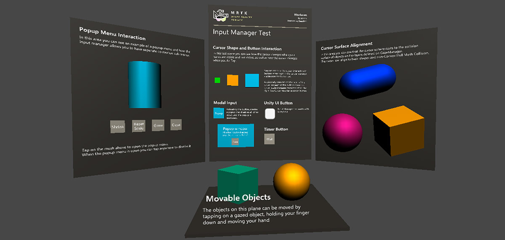
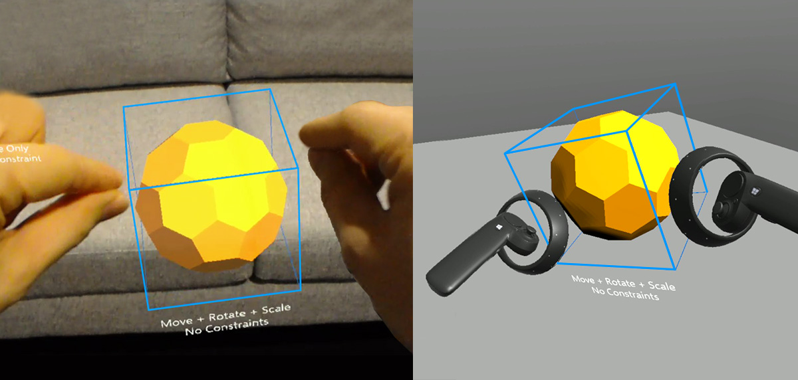
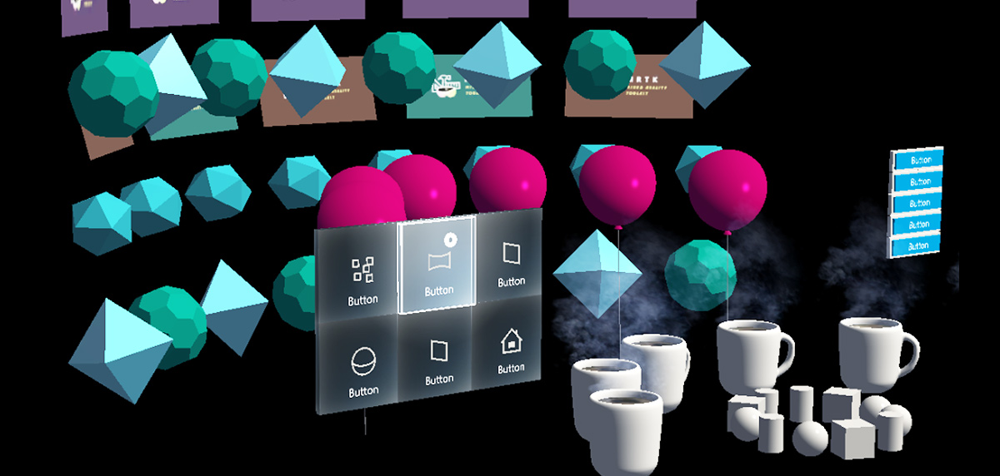
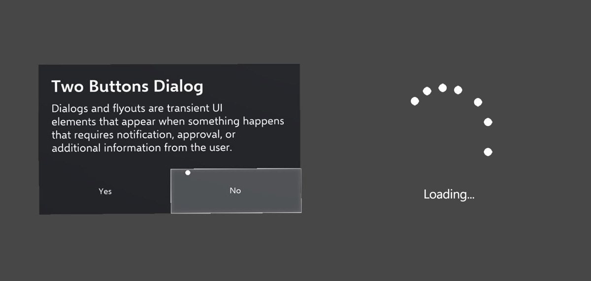
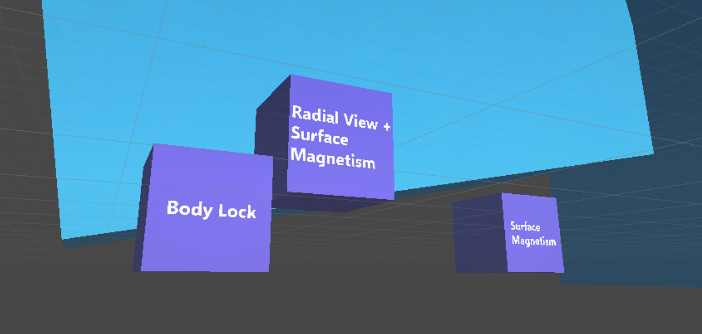
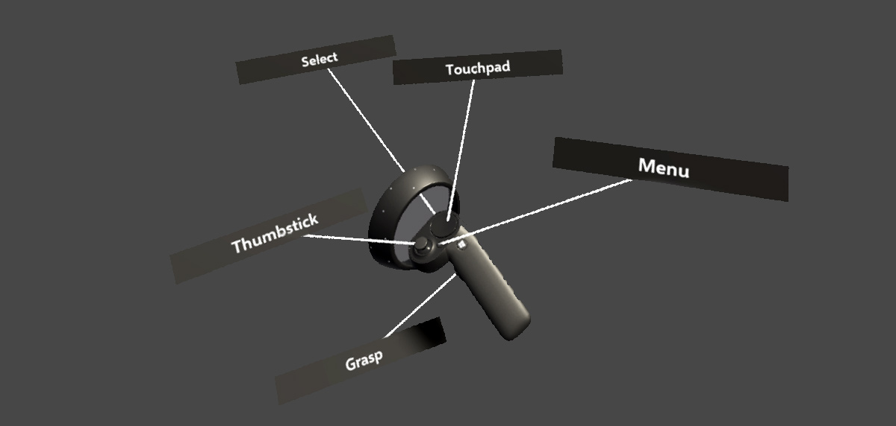

# What is MixedRealityToolkit-Unity?
The Mixed Reality Toolkit is a collection of scripts and components intended to accelerate development of applications targeting Microsoft HoloLens and Windows Mixed Reality headsets.
The project is aimed at reducing barriers to entry to create mixed reality applications and contribute back to the community as we all grow.

MixedRealityToolkit-Unity uses code from the base [MixedRealityToolkit](https://github.com/Microsoft/MixedRealityToolkit) and makes it easier to consume in [Unity](https://unity3d.com/).

> Learn more about [Windows Mixed Reality](https://www.microsoft.com/en-gb/windows/windows-mixed-reality) here.

_Note: The latest release should work for both HoloLens and Windows Mixed Reality development._

[github-rel]:                    https://github.com/Microsoft/MixedRealityToolkit-Unity/releases/latest
[mrtk-version-badge]:            https://img.shields.io/github/tag/microsoft/MixedRealityToolkit-unity.svg?label=Latest%20Master%20Branch%20Release&colorB=9acd32
[![Github Release][mrtk-version-badge]][github-rel]

[unity-download]:                 https://unity3d.com/unity/qa/patch-releases/2017.2.1p2
[unity-version-badge]:            https://img.shields.io/badge/Current%20Unity%20Editor%20Version-2017.2.1p2-green.svg
[![Github Release][unity-version-badge]][unity-download]

> Check out the MRTK-Unity [Roadmap](/Roadmap.md).
>
> Check out the updates from the [Fall Creators update](/FallCreatorsUpdate.md) for Windows Mixed Reality.
>
> Check out the [Breaking Changes](/BreakingChanges.md) from the previous release.

Looking to upgrade your projects to Windows Mixed Reality? [Follow the Upgrade Guide](/UpgradeGuide.md).

# Feature areas
The Mixed Reality Toolkit for Unity includes many APIs to accelerate the development of Mixed Reality projects for both HoloLens and the newer Immersive Headsets (IHMD)

|   [Input](Assets/HoloToolkit/Input/README.md)                                               |  [Sharing](Assets/HoloToolkit/Sharing/README.md)   |  [Spatial Mapping](Assets/HoloToolkit/SpatialMapping/README.md)| 
| :--- | :--- | :--- |
| Scripts that leverage inputs such as gaze, gesture, voice and motion controllers. Includes the Mixed Reality camera prefabs. | Sharing library enables collaboration across multiple devices. | Scripts that allow applications to bring the real world into the digital using HoloLens. | 
|  [Spatial Sound](Assets/HoloToolkit/SpatialSound/README.md) |  [UX Controls](Assets/HoloToolkit/UX/README.md)|  [Utilities](Assets/HoloToolkit/Utilities/README.md) | 
| Scripts to help plug spatial audio into your application. | Building blocks for creating good UX in your application like common controls. | Common helpers and tools that you can leverage in your application. |
|  [Spatial Understanding](Assets/HoloToolkit/SpatialUnderstanding/README.md)|  [Build](Assets/HoloToolkit/BuildAndDeploy/README.md)|  [Boundary](Assets/HoloToolkit/Boundary/README.md)                       |
| Tailor experiences based on room semantics like couch, wall etc.                                                                                  | Build and deploy automation window for Unity Editor.                                                        | Scripts that help with rendering the floor and boundaries for Immersive Devices.

# Required Software
|  [Windows 10 FCU](https://www.microsoft.com/software-download/windows10)|  [Unity 3D](https://unity3d.com/get-unity/download/archive)|  [Visual Studio 2017](http://dev.windows.com/downloads)|  [Simulator (optional)](https://go.microsoft.com/fwlink/?linkid=852626)|
| :--- | :--- | :--- | :--- |
| To develop apps for mixed reality headsets, you need the Windows 10 Fall Creators Update | The Unity 3D engine provides support for building mixed reality projects in Windows 10 | Visual Studio is used for code editing, deploying and building UWP app packages | The Emulators allow you test your app without the device in a simulated environment |

# Getting started with MRTK
To get up and going as quickly as possible, here are some guides to help you get started building Mixed Reality Projects

|  [Quick start](GettingStarted.md) |  [Contributing to this project](CONTRIBUTING.md) |  [Fall Creators Update](FallCreatorsUpdate.md) |
|:--- | :--- | :--- |
| Please go over the [Getting started guide](GettingStarted.md) to learn more about getting off the ground quickly. | Please go over the [Contributing guidelines](CONTRIBUTING.md) to learn more about the process and thinking. | Check out the recent updates for Windows Mixed reality in the [Fall Creators update](/FallCreatorsUpdate.md) |

# Examples - Input
| [Input manager tests](/Assets/HoloToolkit-Examples) |  [Motion Controller tests](/Assets/HoloToolkit-Examples) |  [Grab Mechanics](/Assets/HoloToolkit-Examples/MotionControllers-GrabMechanics) |  [Two Hand Manipulation](/Assets/HoloToolkit-Examples/Input/Readme/README_TwoHandManipulationTest.md) |
|:--- | :--- | :--- | :--- |
| Input and cursor visaulization examples for gaze and motion controller pointers | Demonstrates how to access motion controller input events and data |   Examples of direct manipulation with motion controllers | Script for manipulating objects with two hands |

# Examples - UI controls and building blocks
|   [Bounding Box and App Bar](/Assets/HoloToolkit-Examples/UX/Readme/README_BoundingBoxGizmoExample.md) |  [Interactable Objects](/Assets/HoloToolkit-Examples/UX/Readme/README_InteractableObjectExample.md) |  [Object Collection](/Assets/HoloToolkit-Examples/UX/Readme/README_ObjectCollection.md) | [Keyboard](/Assets/HoloToolkit-Examples) |
|:--- | :--- | :--- | :--- |
| Standard UI for manipulating objects in 3D space | Modular script for making objects interactable with visual states, including Holographic button  | Script for lay out an array of objects in a three-dimensional shape | System style keyboard prefab for Unity projects |  
|  [Dialog](/Assets/HoloToolkit-Examples/UX/Readme/README_DialogsExample.md) / [Progress](/Assets/HoloToolkit-Examples/UX/Readme/README_ProgressExample.md) |  [Solver system](/Assets/HoloToolkit-Examples/Utilities/Readme/README_SolverSystem.md) |  [Interactive button demos](/Assets/HoloToolkit-Examples/UX/Readme/README_InteractiveButtonComponents.md) |  [ToolTip & Label](/Assets/HoloToolkit-Examples/UX/Readme/README_TooltipExample.md) |
| Standard UI for notification, approval, or additional information from the user / Data loading indicator | Scripts for various behavious such as tag-along, billboarding, body-lock, constant view size and surface magnetism  | UWP style UI controls including radio, toggle and checkboxes | Annotation UI with flexible anchor/pivot system which can be used for labeling motion controllers and object. | 

# Examples - Surface reconstruction
| [Spatial Mapping](/Assets/HoloToolkit-Examples/SpatialMapping/Scenes/SpatialMappingExample.unity) |  [Spatial Processing](/Assets/HoloToolkit-Examples/SpatialMapping/Scenes/SpatialProcessing.unity) |  [Spatial Understanding](/Assets/HoloToolkit-Examples/SpatialUnderstanding/Scenes/SpatialUnderstandingExample.unity)  |  [Surface Magnetism](/Assets/HoloToolkit-Examples/SpatialMapping/SpatialProcessingSurfaceMagnetism.md) | 
|:--- | :--- | :--- | :--- |
| Example of visualizing and accessing spatial mapping data. | Example of processing the raw spatial mapping data, finding and creating planes based on spatial mapping meshes. | Examples of the room scanning and accessing identified surfaces such as walls, floors, ceilings and platforms. | Example of making an object smoothly align with physical surfaces using SolverSurfaceMagnetism |

Check out the [Examples](/Assets/HoloToolkit-Examples) folder for more details.

**External\How To** docs folder is meant to help everyone with migrating forward or any simple doubts they might have about the process.
Please feel free to grow all these sections. We can't wait to see your additions!

This project has adopted the [Microsoft Open Source Code of Conduct](https://opensource.microsoft.com/codeofconduct/). 
For more information see the [Code of Conduct FAQ](https://opensource.microsoft.com/codeofconduct/faq/) or contact [opencode@microsoft.com](mailto:opencode@microsoft.com) with any additional questions or comments.

# Useful resources on Microsoft Windows Dev Center
|  [Academy](https://developer.microsoft.com/en-us/windows/mixed-reality/academy)|  [Design](https://developer.microsoft.com/en-us/windows/mixed-reality/design)|  [Development](https://developer.microsoft.com/en-us/windows/mixed-reality/development)|  [Community](https://developer.microsoft.com/en-us/windows/mixed-reality/community)|
| :--------------------- | :----------------- | :------------------ | :------------------------ |
| See code examples. Do a coding tutorial. Watch guest lectures.          | Get design guides. Build user interface. Learn interactions and input.     | Get development guides. Learn the technology. Understand the science.       | Join open source projects. Ask questions on forums. Attend events and meetups. |
